# 02. JS 데이터 

### (1) 개요 및 프로젝트 구성 

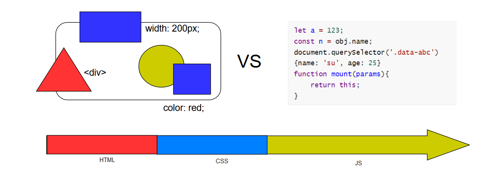


#### ◼ ECMA 스크립트 

> #####  자바스크립트 표준이름이 ECMAScript 이고 이것을 줄여서 ECMA 라고 한다. (ES = JS)


#### ◼ (1) package.json 

```javascript
  "scripts": {
    "dev": "parcel ./index.html",
    "build": "parcel build ./index.html" 
  },
```

> 개발 서버를 열어 테스트 할 때는 dev 라는 명령으로 스크립트를 시작하면 되고, 
>
> 실제 그것을 제품화 해서 서버로 배포하는 경우에는 build 명령을 사용하면 된다. 


#### ◼ (2) index.html 파일 생성

```html
<script type="module" defer src="./main.js"></script>
```

> * defer 속성은 페이지가 모두 로드된 후에 해당 외부 스크립트가 실행됨을 명시한다. 


#### ◼ (3) main.js 파일 생성

```javascript
//test
console.log(123)
```


#### ◼ (4) 서버 실행

```bash
npm run dev
```


#### ◼ (5) 초기설정 완료 


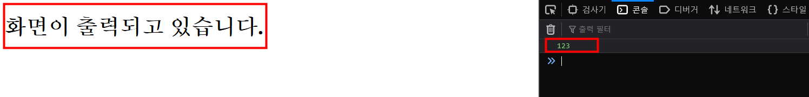


---


### (2) 원시형 - String, Number

#### ◼ String 

```javascript
const string1 = "Hello"
const string2 = 'Hello'
const string3 = `Hello`
```

> `" "` 와 `' '` 는 한 가지를 선택하여 코드를 작성하면 된다. 
>
> 하지만 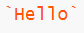 표시는 선택의 개념보다는 `보관` 이라는, 어떠한 데이터를 문자데이터 내부에 채워 넣는 용도로 사용할 수 있다. 
>
> 보관 처리를 할때는 `Hello ${}` 달러기호와 중괄호를 이용하여 사용 할 수 있고, 중괄호 안에 어떠한 데이터를 채워줄 수 있다. 
>
> **🤔 string1 을 채워넣어준다면?** 
>
> ```javascript
> const string3 = `Hello ${string1} ?!`
> ```
>
> 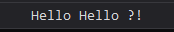
>
> 📚 이렇게, ` 기호를 통해서 문자 데이터를 만드는 방식을  **템플릿 리터럴** 이라고 한다. 


#### ◼ Number

```javascript
const number = 123

console.log(number + 1)
```

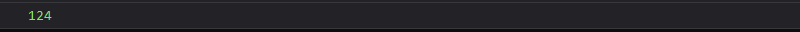

> 숫자 데이터는 기본적으로 양수를 나타내는데, **음수**도 나타낼 수 있다. 
>
> ```javascript
> const number = -123
> 
> console.log(number + 1)
> ```
>
> 또한 **부동소수점**도 나타낼 수 있다. 
>
> ```javascript
> const number = -123.1234
> const pi = .14
> 
> console.log(number + 1)
> console.log(pi)
> ```
>
> > `const  = 0.14` 를 `const = .14` 라고 표시할 수 있다. 
> >
> > 
>
> 
>
> ##### 🔥 주의할점
>
> ```javascript
> console.log(number + undefined)
> ```
>
> 출력이  으로 나온다. `NaN`은 `Not a Number` 라는 약어이다. 
>
> ##### 데이터 타입은 숫자이지만, 숫자로 표기할 수 없는 값을 의미한다. (긍정보다는 부정)
>
> 
>
> ```javascript
> console.log(typeof (number + undefined))
> console.log(typeof pi)
> ```
>
> 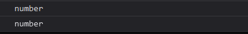


```javascript
const a = 0.1
const b = 0.2

console.log(a + b) //0.3
```

> `0.3` 라는 결과를 예상했지만  다른 값이 나왔다. 
>
> 
>
> ##### 🤔 왜일까? 
>
> `부동소수점 오류`라고 해서 컴퓨터가 기본적으로 0 과 1의 이진수를 사용해서 동작하게 되는데
>
> 기본적으로 숫자를 사용하려면 10진수를 사용해야한다. 따라서 컴퓨터가 10진수를 이진수로 표현해야하기 때문에 간혹 `무한 소수` 라는 개념이 발생하게 된다. 
>
> 이것을 무한한 것이 아니고 유한하게 표현하기 위해서 세부적인 값에 초과나 혹은 손실로 계산 오류가 발생할 수 있다. 
> 
>
> ##### 🤔 소수점 한 자리만 남게 하고 싶다면? 
>
> ```javascript
> console.log((a + b).toFixed(1))
> ```
>
> ##### ※ 주의해야할점 : toFixed는 숫자데이터를 문제데이터로 바꾸게 된다. 
>
> 일반적으로 숫자 데이터를 출력하게 되면, 파랑색 글씨로 출력하게 된다.
>
> ```javascript
> console.log(typeof (a + b).toFixed(1))
> ```
>
> 타입을 확인해보면, 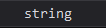 `문자` 임을 알 수 있다. 따라서 `Number` 라는 함수를 통해서 숫자 데이터를 포함하고 있는 문자데이터를 숫자 데이터로 변환해준다. 
>
> ```javascript
> console.log(Number ((a + b).toFixed(1)))
> ```
>
> 


---


### (3) 원시형 - Boolean, null, undefined

#### ◼ Boolean (불린)

> true, false 2가지 값만 사용하는 `논리 데이터` 이다.  


##### ✔ true(긍정)

```javascript
const a = true
const b = false

if(a) {
    console.log('hi')
}
```

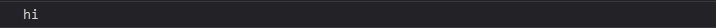


##### ✔ false(부정)

```javascript
const a = true
const b = false

if(b) {
    console.log('hi')
}
```


#### ◼ Null

```javascript
let age = null
```

> null : 존재하지 않는다, 값이 비어있다, 값을 알 수 없다.


```javascript
let age = null

console.log(age)

setTimeout(function () {
    age = 25
    console.log(age)
}, 1000)
```

> 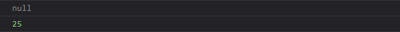
>
> age는 값이 명시되지 않았음이었는데, 1초 뒤에 다른 숫자 데이터로 변경이 되었고 그것이 콘솔에 출력이 되었음을 알 수 있다. 


#### ◼ undefined

> null과 동일하게 값이 없는 상태이다.  undefined는 따로 작성하지 않아도 알 수 있다. 

```javascript
let age 

console.log(age)

setTimeout(function () {
    age = 25
    console.log(age)
}, 1000)
```

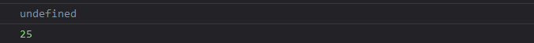


##### 🤔 암시적? 

> 직접 값을 할당하지 않아도 이미 그 값이 존재하고 있다. 
> = 어떤 변수에 값이 할당되어 있지 않은 상태를 의미한다. 


| null                                                  | undefined                       |
| ----------------------------------------------------- | ------------------------------- |
| **명시적**으로 값이 없다는 것을 직접 입력을 하는 개념 | **암시적**으로 값이 없다는 개념 |


---


```javascript
const user = {
    name : 'su',
    age: 25
}

console.log(user)
```

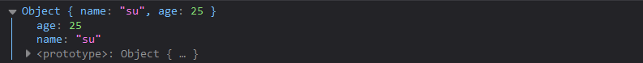

> 객체데이터를 확인할 수 있다. 객체데이터 안에는 name이라는 속성, age 라는 속성이 있다. 
>
> ```javascript
> console.log(user.name)
> console.log(user.age)
> ```
>
> 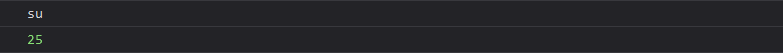
>
> 하지만 `console.log(user.email)` 의 결과를 확인하고자 한다면, `undefined` 이 출력된다.
>
> 의도적으로 email 속성에 값이 비어있다라는 것을 명시적으로 나타내기 위해서는 
>
> ```javascript
> const user = {
>     name : 'su',
>     age: 25,
>     email: null
> }
> ```
>
> null 이라는 값을 할당해서 email이 없음을 표시해주면 되는 것이다. 
>
> 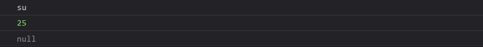

